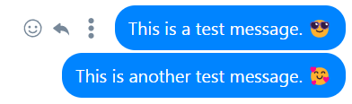
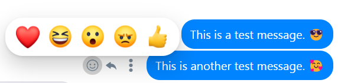
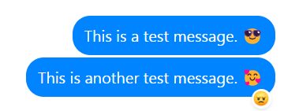
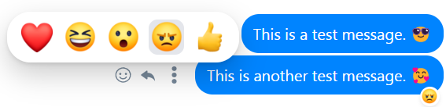
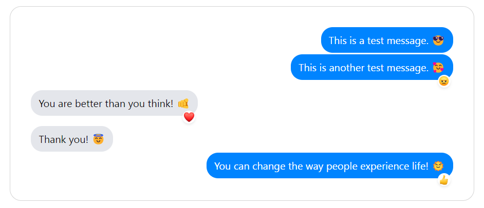

This project reassemble the **Facebook Messenger** message with support for action items like **reaction (with emojis)**, **reply** and **more options**.
All the action items can be extended to your personal preference. I added a basic usage for the reaction system with the default emojis used from **Facebook Messenger**.

<br />

**Technologies / libraries used:**

- **React** with **TypeScript** powered by Vite Application with npm (`npm create vite@latest`)
- **clsx** for managing className composition
- **svgr** plugin for vite in order to import the svg files directly into React

The Message component doesn't fully support all the features and edge cases from a normal chat application. Basic emojis are supported, there is no implementation for reply or more options (only the event listeners in place) action items.

<br />

**Usage:**

In order to show a message we use the **Message** component which accepts 2 properties: `text: string` and `align?: MessageAlignment`.<br/>
The `MessageAlignment` definition supports 2 options: `LEFT` or `RIGHT`. I used the default color scheme from Facebook messages for each position. This, or course, can be extended to support different color schemes.

```javascript
// If you don't set an alignment, then the `RIGHT` one is used by default.
<Message text="You can change the way people experience life! 🌞" />

// Same as above definition
<Message text="You can change the way people experience life! 🌞" align={MessageAlignment.RIGHT} />

// LEFT alignment
<Message text="You can change the way people experience life! 🌞" align={MessageAlignment.LEFT} />
```

<br />

**Flows:**

- **message hover:**<br />
  
- **reaction action item clicked:** <br />
  
- **reaction selection:** <br />
  
  
- **standard usage:** <br />
  

<br />

**Available scripts:**

- install the dependencies: `npm install`
- run the application in development mode: `npm run dev`
- build the application: `npm run build`
